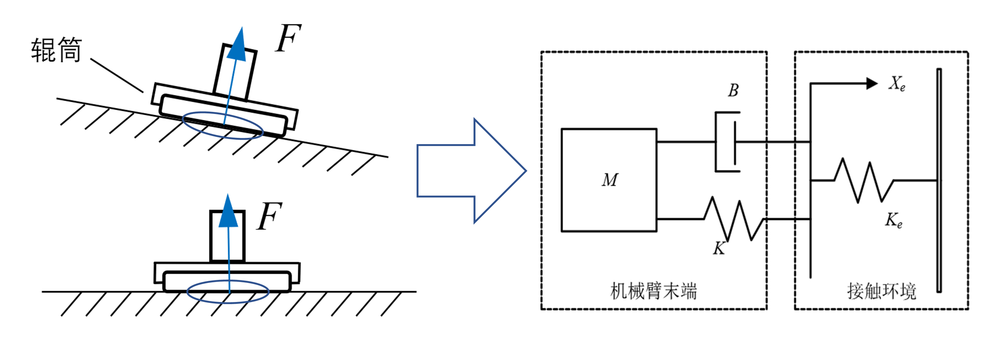
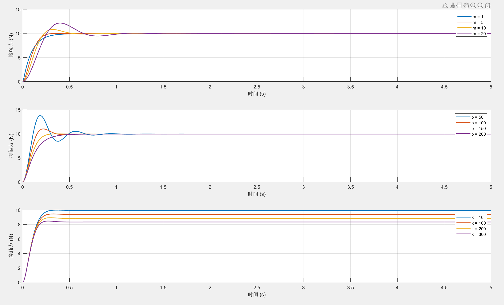
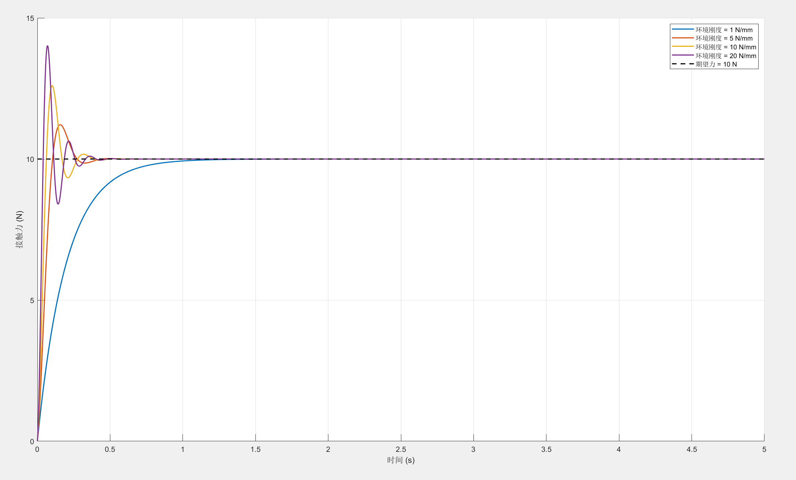
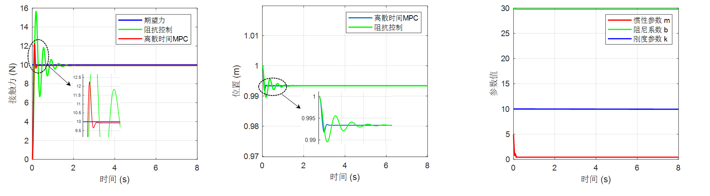
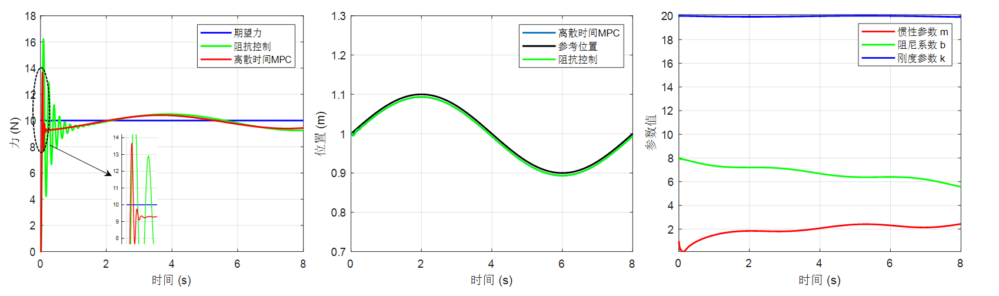
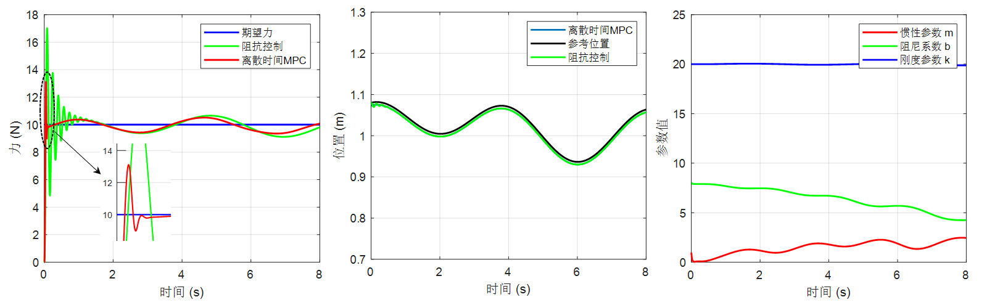
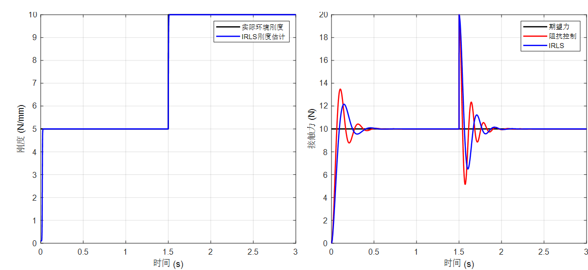
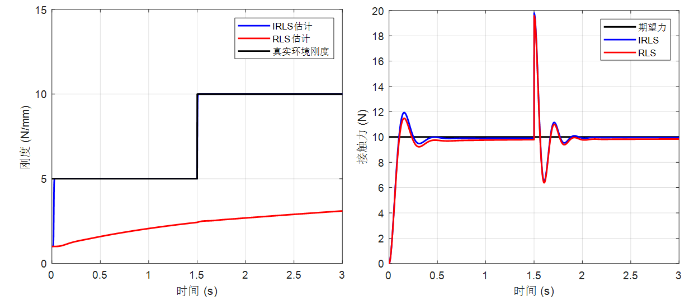
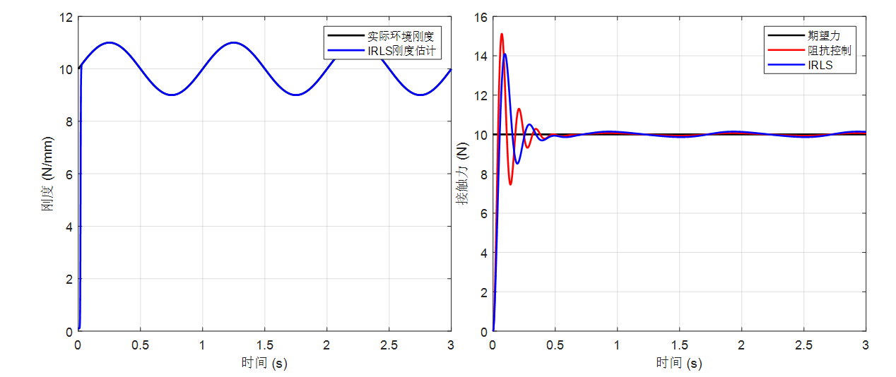
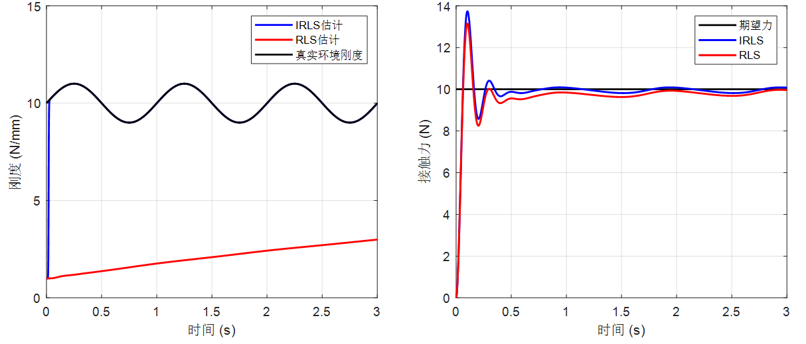

## 📖1. 项目简介 (Introduction)

本仓库提供了一套用于机器人接触任务的 **MATLAB 仿真代码**，以及 **Python 仿真代码**特别针对大型风电叶片的自动辊涂场景 。

---

## 🚀2. 开始使用 (Getting Started)

若要运行此仿真代码，您的开发环境需要满足以下条件：

### 软件要求

* **[MATLAB](https://ww2.mathworks.cn/products/matlab.html)**

### 所需工具箱

* **[Optimization Toolbox](https://ww2.mathworks.cn/products/optimization.html)**
### 软件要求

* **[Python 3](https://www.python.org/)**

### 所需第三方库

* **[NumPy](https://numpy.org/)**
* **[Pandas](https://pandas.pydata.org/)**
* **[Matplotlib](https://matplotlib.org/)**
* **[SciPy](https://scipy.org/)**

---

## 📂3. 文档内容 (Documentation Content)

本项目的核心研究内容分为基础特性分析、DT-MPC 变参数阻抗控制策略验证，参数辨识算法对比，全局路径规划相关。

### 3.1 基础阻抗控制特性分析

该部分用于分析阻抗参数及环境刚度对系统响应的具体影响 ：

* **接触力学模型**：将辊筒与工件表面的接触过程等效为弹簧模型 。

* **阻抗控制器公式**：

$$m(\ddot{x} - \ddot{x}_d) + b(\dot{x} - \dot{x}_d) + k(x - x_d) = f_e - f_d$$

* **机器人末端与环境的接触力为**：

$$
f_e = \begin{cases} 
k_e(x_e - x), & x < x_e \\ 
0, & x \geq x_e 
\end{cases}
$$

 •	期望接触力设置为 $f_d = 10N$，环境位置设置为 $x_e = 0m$。

* **阻抗参数**：在保持其他两个参数不变的条件下，分别依次改变惯性参数 $M$、阻尼参数 $B$ 或刚度参数 $K$ 的值，得到对应的接触力响应曲线 。

此处对应目录下的 [ImpedanceControl003.m](./ImpedanceControl003.m) 

* **环境刚度**：不同环境刚度对接触力产生的变化影响 。

此处对应目录下的 [ImpedanceControl001.m](./ImpedanceControl001.m) 

### 3.2 DT-MPC 变参数阻抗控制

使用离散时间模型预测控制在线优化阻抗参数，以适应不同的工作表面 ：

* **平面环境**：测试在标准平面下的控制效果 。
  
此处对应目录下的 [MPC.m](./MPC.m) 

* **正弦曲面环境**：测试机器人在规则波动表面上的控制效果 。
  
此处对应目录下的 [MPC001.m](./MPC001.m) 

* **不规则曲面环境**：测试在复杂、随机变化表面下的控制效果 。
  
此处对应目录下的 [MPC002.m](./MPC002.m) 
* 

### 3.3 环境刚度参数辨识

对比了两种算法在环境刚度发生变化时的辨识表现 。

* **基础设定**：期望力设置为 $f_d=10\text{N}$，阻抗控制参数分别设置为 $m=10$， $b=200$， $k=50$。

* **刚度突变仿真**：环境刚度在 $t=1.5\mathrm{s}$ 时从 $5\mathrm{N/mm}$ 突变至 $10\mathrm{N/mm}$。

* 对比 IRLS 与不使用参数辨识在突变环境下的性能差异 。

此处对应目录下的 [Parameter_identification003.m](./Parameter_identification003.m) 

* 对比 IRLS 与 RLS 在突变环境下的跟踪精度 。

此处对应目录下的 [Parameter_identification002.m](./Parameter_identification002.m) 

* **刚度波动仿真**：环境刚度设置为以 $10\mathrm{N/mm}$ 为中心、上下正弦波动 $1\mathrm{N/mm}$。 。

* 对比 IRLS 与不使用参数辨识在波动环境下的性能差异 。

此处对应目录下的 [Parameter_identification004.m](./Parameter_identification004.m) 

* 对比 IRLS 与 RLS 在波动环境下的跟踪精度 。

此处对应目录下的 [Parameter_identification001.m](./Parameter_identification001.m) 

### 3.4 全局路径规划相关

对一半叶片的点云进行AGV的全局路径规划 。

此处对应目录下的 [Parameter_Global_path_planning.py](./Global_path_planning.py) 

